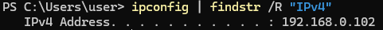
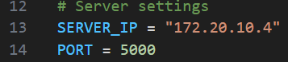

# How to

This document explains practical details on how to get the code up and running. Go through the README.md file first for practical set up tips. This does not cover ALL functionality, but just the main features of interest to the thesis.

## MNIST

1. The nVidia Jetson Nano must be loaded with the DNN image, and connected to the same network as the PC. From the base directory, create a virtual environment, and install the requirements (see README.md for details), this is only for the PC.
2. The files for performing MNIST operations are located within the `MNIST` folder. As a first step, we must identify the IP value for the server (our Desktop / Laptop computer). We can do this by running the following command in Windows
```
ipconfig | findstr /R "IPv4"
```
Or in Linux
```
hostname -I
```
Which should lead to an output like this

3. We take that number, and jot it into the `MNIST/config.py`file for the `SERVER_IP` value. This will inform the Jetson Nano, how to find the server on the local network.

4. Run `server.py`. This will set up a server to start listening.
5. Copy over the files in the MNIST folder to a USB stick. Then, move it over to the desktop. Note, that you may need to temporaily remove the WIFI module in order to have enough room to insert the USB stick.
6. Open the folder, and right click in the white area then select `Open in Terminal`. Type `code` to open the folder in VS Code.
7. Check to make sure that the ip value in the value is correct. Then, in the terminal interface enter `python client.py 1`, where 1 is the client ID.
8. The server connection should be established, and now training should occur. The `server.py` will create additional virtual clients, up to the value provided in the `config.py` file via the `CLIENT_COUNT` argument.